# Capstone Project - Azure Machine Learning Engineer

*TODO:* Write a short introduction to your project.

As it is our final project in Udacity program, we chose to apply what we learned to a forecasting model. For this purpose we took our inspiration from this [git repository](https://github.com/microsoft/forecasting/blob/86b421b71826b92e47c3e3cb6cdcbf7ff4a63b90/examples/grocery_sales/README.md)

The project is about the Orange Juice dataset. We use two methods to select the best forecasting model. The first method consists of tuning the scikit learn model LightGBM. The second method is to configure AutoML with a task of forecasting. We refer to the primary metric Mean Absolute Percentage Error (MAPE). The model that obtains the lowest value of MAPE is deployed using Python SDK. After that, we test the deployed model by sending a request to its active endpoint.

## Project Set Up and Installation
*OPTIONAL:* If your project has any special installation steps, this is where you should put it. To turn this project into a professional portfolio project, you are encouraged to explain how to set up this project in AzureML.

## Dataset

### Overview
*TODO*: Explain about the data you are using and where you got it from.

We use the Orange Juice dataset taken from the R package [Bayesian Inference for Marketing/Micro-Econometrics](https://cran.r-project.org/web/packages/bayesm/index.html) (bayesm). It represents weekly sales of refrigerated orange juice at 83 stores. Also, it contains demographic information on those stores. To be able to use this dataset, we run an R script to convert the orangeJuice.rda located in "./starter_file/ojdata" into two files :

  - "xy.csv" : Weekly sales of refrigerated orange juice at 83 stores. It has 106139 rows and 19 columns.
  
              $store : store number
              
              $brand : brand indicator
              
              $week : week number
              
              $logmove : log of the number of units sold
              
              $constant : a vector of 1s
              
              $price# : price of each brand. It is 11 columns.
              
              $deal : in-store coupon activity
              
              $feature : feature advertisement
              
              $profit : profit obtained
              
  - "storedemo.csv" : Demographic information on the 83 stores. It has 83 rows and 13 columns. 
  
              $STORE : store number
              
              $AGE60 : percentage of the population that is aged 60 or older
              
              $EDUC : percentage of the population that has a college degree
              
              $ETHNIC : percent of the population that has different ethnicity
              
              $INCOME : median income
              
              $HHLARGE : percentage of households with 5 or more persons
              
              $WORKWOM : percentage of women with full-time jobs
              
              $HVAL150 : percentage of households worth more than $150,000
              
              $SSTRDIST : distance to the nearest warehouse store
              
              $SSTRVOL : ratio of sales of this store to the nearest warehouse store
              
              $CPDIST5 : average distance in miles to the nearest 5 supermarkets
              
              $CPWVOL5 : ratio of sales of this store to the average of the nearest five stores

We use the two files to generate two directories "train" and "test". The "train" directory includes "train.csv" and "auxi.csv" with "train.csv" containing the historical sales up to week 135 (the time we make forecasts) and "auxi.csv" containing price/promotion information up until week 138. We assume that future price and promotion information up to a certain number of weeks ahead is predetermined and known. On the other hand, the directory "test" has the sales of each product in week 137 and 138. 

### Task
*TODO*: Explain the task you are going to be solving with this dataset and the features you will be using for it.

In this dataset, we start from the week 40 to the week 138. We are interested in the attribute "logmove", also we need to compute its exponentiel to be abele to use it in our analysis. So, we create a new column named "move" which becomes our target. Also, we add a new column "week_start" to become a timestamp for our dataset.

Our task is to forecast the sales of the two weeks 137 and 138. The week 136 is represented as a gap to leave time for planning inventory as in real life. To fulfill this task, we train our model from the week 40 until the week 135 to predict the attribute "move". 

### Access
*TODO*: Explain how you are accessing the data in your workspace.

In this project, we use two methods to access the data in our workspace. For the Automated ML case, we save two csv files "train_automl.csv" and "test_automl.csv" in our local directory. After that we upload these files into the default datastore. For the hyperdrive case, we register the two files "train.csv" and "auxi.csv" of the "train" directory. Here is a proof of the two registered datasets.

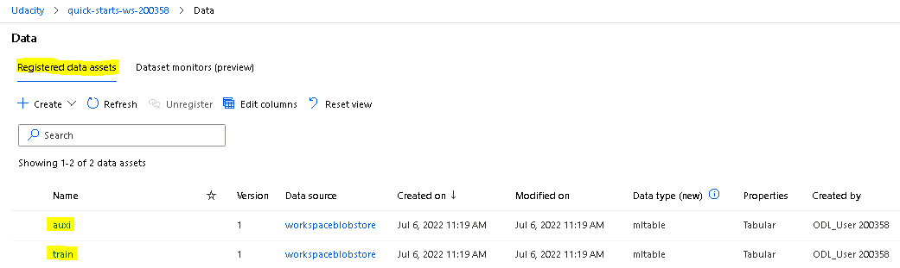

## Automated ML
*TODO*: Give an overview of the `automl` settings and configuration you used for this experiment

We use the [AutoMLConfig class](https://docs.microsoft.com/en-us/python/api/azureml-train-automl-client/azureml.train.automl.automlconfig.automlconfig?view=azure-ml-py) to configure our Automated ML experiment, as shown bellow.

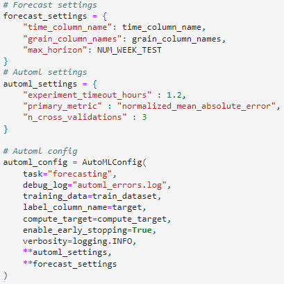

For the forecast settings dictionary, we define:

  - "time_column_name" : week_start column defined as a timestamp.
  - "grain_column_names": the columns ["store", "brand"] that defines each time serie.
  - "max_horizon": equals to 3. We forecast threew weeks 136, 137 and 138.
 
For the AutoML settings dictionary, we define:

  - "experiment_timeout_hours" : 1.2 hours. The experiment is costly in term of time.
  - "primary_metric": Normalized Mean Absolute Error should be minimizeed.
  - "n_cross_validation": 3 folds. It divides our training set into 3 folds. It helps our model to not overfit.
  
We define the AutoML configuration as follow:

  - "task": "forecasting". Our model should forecast the attribute "move".
  - "debug_log": "automl_errors.log". If a problems occurs. this file helps us debug.
  - "training_data": train_dataset contains the "train_automl.csv" file.
  - "label_column_name": the variable target represent the attribute "move".
  - "compute_target": compute_target. We use our compute cluster defined in the notebook. Also, our code checks for existing compute clusters before creating a new one.
  - "enable_early_stopping: True. To terminate the run if there is no improvement in the score.
  - "verbosity": logging.INFO. It writes on the log file "automl.log".

### Results
*TODO*: What are the results you got with your automated ML model? What were the parameters of the model? How could you have improved it?

We submit the Automated ML experiment and wait until it is completed. The figure bellow describes the status of each model in the `RunDetails` widget.
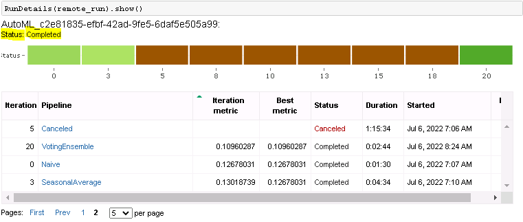

Also, we have an overview of different values of MAPE obtained by each model.
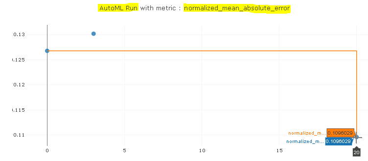

We use the primary metric Normalized Mean Absolute Error (NMAE) instead of MAPE, because it is not supported as an argument, as we can see in the figure below.
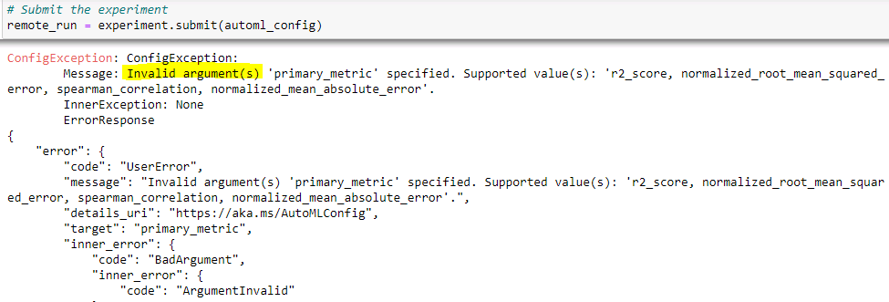

So, the chosen algorithm is the Voting ensemble with the minimum NMAE value. Also, we can obtain the MAPE of this model, which is 95.582 %.
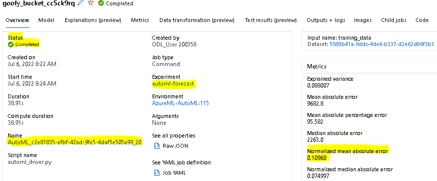

We could improve our result by increasing the time of the "experiment_timeout_hours". Indeed, our training takes a lot of time fo each algorithm. So, many algorithms have been canceled. However, our lab has only 8 hours which is not sufficient in this case.

## Hyperparameter Tuning
*TODO*: What kind of model did you choose for this experiment and why? Give an overview of the types of parameters and their ranges used for the hyperparameter search

Our datset is abuot forecastinng sales by product, so we choose [LightGBM](https://towardsdatascience.com/multi-step-time-series-forecasting-with-arima-lightgbm-and-prophet-cc9e3f95dfb0#:~:text=LightGBM%20is%20a%20popular%20machine,trend%20and%20seasonality%20(Nile%20dataset)) of Scikit learn for this experiment.

We define our [hyperparameters](https://lightgbm.readthedocs.io/en/latest/Parameters.html) as follow :
  - "--num-leaves": quniform(8, 128, 1)
  
  - "--min-data-in-leaf": quniform(20, 500, 10)
  
  - "--learning-rate": choice( 1e-4, 1e-3, 5e-3, 1e-2, 1.5e-2, 2e-2, 3e-2, 5e-2, 1e-1)
  
  - "--feature-fraction": uniform(0.2, 1)
  
  - "--bagging-fraction": uniform(0.1, 1)
  
  - "--bagging-freq": quniform(1, 20, 1)
  
  - "--max-rounds": quniform(50, 2000, 10)
  
  - "--max-lag": quniform(3, 40, 1)
  
  - "--window-size": quniform(3, 40, 1)

We use Bayesian Parameter Sampling over our hyperparameter search space defined previously. Indeed, in the Azure documentation, the bayesian method tries to intelligently pick the next sample of hyperparameters, based on how the previous samples performed, such that the new sample improves the reported primary metric "MAPE". As a result, we do not use an early termination policy.

### Results
*TODO*: What are the results you got with your model? What were the parameters of the model? How could you have improved it?

After the hyperdrive configuration, we submit the experiment. We provide the following screenshots of the 'RunDetails' widget.

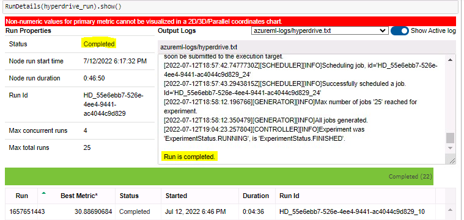
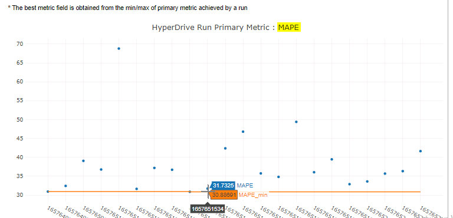

We train our LightGBM model in 25 runs with "max_concurrent_runs = 4". We obtain a value of MAPE equal to 30.704 %. In the figure below, we can see the best hyperparameters obtained by the model.
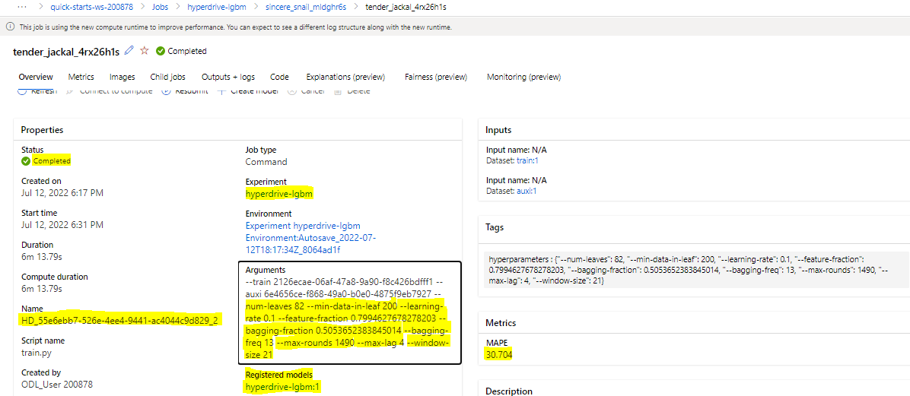

We could improve it by increasing the number of runs as suggested in the warning bellow.

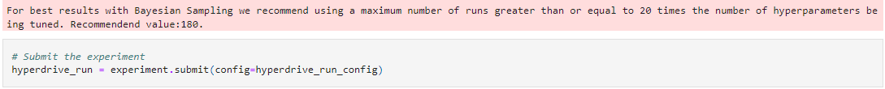

## Model Deployment
*TODO*: Give an overview of the deployed model and instructions on how to query the endpoint with a sample input.

In this project, we have a requirement of deploying the best model. So, we will deploy the LightGBM model that obtained a MAPE equal to 30.704 %, instead of the AutoML best algorithm, the "Voting Ensemble" that obtained a value of MAPE equal to 95.582 %. 

We begin with the [InferenceConfig class](https://docs.microsoft.com/en-us/python/api/azureml-core/azureml.core.model.inferenceconfig?view=azure-ml-py). We implement "score.py" file and we download the environment file of the best run "conda.yml".After that, we use AciWebservice (https://docs.microsoft.com/en-us/python/api/azureml-core/azureml.core.webservice.aci.aciwebservice?view=azure-ml-py) for the deployment configuration. Finally, we deploy the registered model as a web service named "lightgbm-forecast-oj".

We obtain a healty deployment as shown bellow.

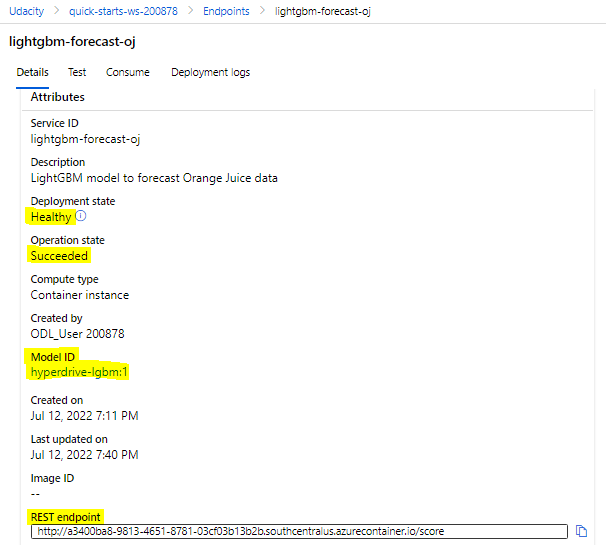

Our sample input has a length of 1826, containing two weeks 137 and 138. We prepare features according to the input schema of the LightGBM model. We define a method "compute_mape" that computes the MAPE value using the ground truth, which is the attribute "move", and the forecasts obtained by the request's response. We get a MAPE equal to 46.67 %. This value is less than 50 %, which is a good test result.

## Standout Suggestions
*TODO (Optional):* This is where you can provide information about any standout suggestions that you have attempted.

We wanted to convert our AutoML model to ONNX format. However, due to an incompatibility reason for a forecasting task, we were unable to set "True" the parameter "enable_onnx_compatible_models". Here is a proof of the error. 
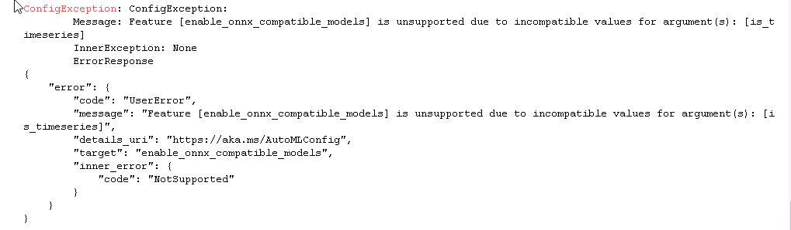
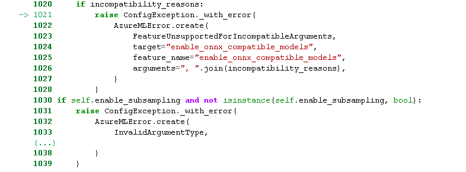

Also, for the deployed model LightGBM, we enable logging with the application insights. We give two proofs for it.

